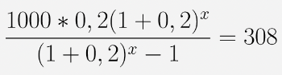

# README

Nexoos Challenge

API capaz de gerir empréstimos, salvando informações necessárias do cliente para podermos realizar o cálculo do valor da parcela (PMT), além de haver a possibilidade de leitura desses dados pelo cliente.

Setup:

```
rbenv install 2.7.2
bundle install
rails db:migrate
rails server
```

Para salvar as informações necessárias dos clientes será necessário enviar um Post Request para Loans:

```
curl --request POST http://localhost:3000/loans -d \
"value=1000& \
taxa=0.2"
```

Exemplo de Response:

```
{
  "loan": {
    "id": 1
  }
}
```

Para a leitura do valor da parcela (PMT) será necessário enviar um Get Request para Loans:

```curl --request GET http://localhost:3000/loans/1```

Exemplo de Response:
```
{
  "loan": {
    "id": 1, "pmt": 308
  }
}
```

Observações:

A fim de se manter fiel ao desafio proposto, foi necessário pressupor que o número de meses de todos os empréstimos foram de 5.75.
Este número foi retirado a partir da solução da equação a baixo. Dados retirados da descrição do desafio.


